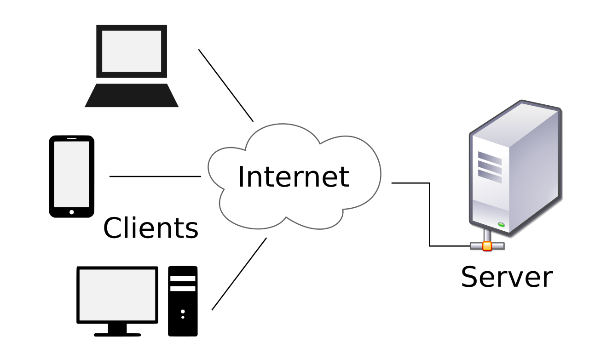

# Introducción a Servidores Web, Node.js, NPM, Vite y SPA

## ¿Qué es un servidor web?

Un **servidor web** es un software que entrega contenido o servicios a los usuarios a través de Internet. Su función principal es recibir peticiones HTTP desde los navegadores y responder con archivos HTML, CSS, JS, imágenes, etc.

Ejemplos de servidores web incluyen:
- Apache
- Nginx
- Express.js (con Node.js)
- Vite (como servidor de desarrollo)



---

## ¿Qué es Node.js?

**Node.js** es un entorno de ejecución de JavaScript en el servidor. Está construido sobre el motor V8 de Chrome y permite ejecutar JavaScript fuera del navegador.

Beneficios:
- Permite usar JavaScript en el backend.
- Orientado a eventos y no bloqueante (ideal para apps en tiempo real).
- Usado para construir servidores, APIs, herramientas de línea de comandos y más.

---

## ¿Qué es NPM?

**NPM** (Node Package Manager) es el sistema de gestión de paquetes de Node.js. Permite instalar librerías, frameworks y herramientas de desarrollo.

Comandos comunes:
- `npm install` – Instala dependencias.
- `npm init` – Crea un archivo `package.json` para definir un proyecto.
- `npm run <script>` – Ejecuta un comando definido en los scripts del proyecto.

---

## ¿Qué es Vite?

**Vite** es una herramienta de construcción (build tool) y servidor de desarrollo rápido para proyectos frontend. Soporta módulos ES y es muy usado con frameworks como React, Vue, Svelte, entre otros.

Ventajas de Vite:
- Compilación rápida gracias a ESBuild.
- Hot Module Replacement (HMR) eficiente.
- Configuración mínima para empezar.

---

## Crear un servidor web local con Vite

Pasos para iniciar un proyecto con Vite:

```bash
# 1. Inicializar proyecto Node
npm init -y

# 2. Instalar Vite como dependencia de desarrollo
npm install -D vite

# 3. Crear un script para levantar el servidor
# En el archivo package.json, dentro de "scripts":
"scripts": {
  "dev": "vite"
}

# 4. Ejecutar el servidor
npm run dev
```

Esto levantará un servidor de desarrollo y servirá tu proyecto en `http://localhost:5173` por defecto.

---

## ¿Qué es una SPA (Single Page Application)?

Una **SPA (Single Page Application)** es una aplicación web que se carga completamente desde una única página HTML. A medida que el usuario navega, el contenido de la página se actualiza dinámicamente mediante JavaScript sin necesidad de recargar completamente el navegador.

### ¿Cómo funciona?

Cuando se accede a una SPA:
1. Se descarga una única página HTML junto con los recursos JavaScript y CSS.
2. Todo el enrutamiento se gestiona en el navegador utilizando APIs como `history.pushState`.
3. Al cambiar de "vista", la aplicación intercambia componentes o fragmentos de HTML de forma dinámica.

### Ventajas de las SPA:
- ✅ Navegación rápida: no hay recarga total de página.
- ✅ Mejor experiencia de usuario: la interfaz se comporta como una app nativa.
- ✅ Reducción en la carga del servidor: solo se solicitan datos cuando se necesitan.
- ✅ Fluidez al interactuar con APIs externas.

### Desventajas de las SPA:
- ❌ **SEO limitado**: como el contenido se genera en el cliente, los motores de búsqueda pueden tener problemas para indexarlo correctamente.
- ❌ Tiempo de carga inicial más largo: toda la lógica y recursos deben descargarse desde el principio.
- ❌ Mayor complejidad en la gestión del estado del cliente y enrutamiento.

### ¿Cuándo usar una SPA?

Las SPA son ideales para:
- Paneles administrativos (dashboards).
- Aplicaciones con muchas interacciones del usuario.
- Proyectos donde se prioriza la experiencia fluida sobre la indexación SEO.

Para resolver el problema del SEO, se puede considerar:
- **Renderizado del lado del servidor (SSR)**.
- **Pre-rendering de rutas estáticas**.
- **Uso de frameworks como Next.js, Nuxt o SvelteKit.**

---

## Conclusión

El uso de herramientas modernas como Node.js, NPM y Vite permite desarrollar aplicaciones SPA de manera eficiente. Aunque las SPA ofrecen ventajas claras en la experiencia de usuario, es importante considerar sus limitaciones en SEO y evaluar si son la mejor solución según el tipo de proyecto.
